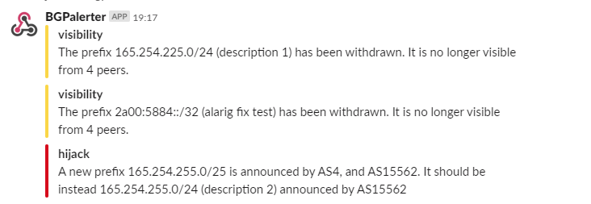

# BGPalerter
Real-time BGP monitoring tool, pre-configured for visibility loss and hijacks detection.

You just run it. You don't need to provide any data source or connect it to anything in your network since it connects to public repos.

It can deliver alerts on files, by email, on slack, and more.

> The tool connects to public data repos (not managed by NTT) and the entire monitoring is done directly in the application (there are no NTT servers involved). 
 
## TL;DR (1 minute setup)
> This section is useful if you don't care about the source code but you just want to run the monitor.
Instead, if you want to run the source code (which is completely open) or develop, please read directly the documentation.

1. Download the binary [here](https://github.com/nttgin/BGPalerter/releases) (be sure to select the one for your OS)

2. Execute the binary (e.g. `chmod +x bgpalerter-linux-x64 && ./bgpalerter-linux-x64`)  
The first time you run it, the auto-configuration will start.  

If something happens (e.g. a hijack) you will see the alerts in `logs/reports-YYYY-MM-DD.log`. 
In `config.yml` you can find other reporting mechanisms (e.g. email and slack) in addition to logging on files. 
Please uncomment the related section and configure according to your needs. 

If the installation doesn't go smoothly, read [here](docs/installation.md).  
Read the documentation below for more options.

[Read here how we release BGPalerter and our effort in making it rock solid.](docs/release-process.md)

## Documentation

- [Installation](docs/installation.md)
    - [Run from binary](docs/installation.md#running-bgpalerter-from-binaries)
    - [Run from source code](docs/installation.md#running-bgpalerter-from-the-source-code)
    - [Run in Docker](docs/installation.md#running-bgpalerter-in-docker)
    - [Run as a Linux service](docs/linux-service.md)
- [Monitored prefixes list](docs/prefixes.md#prefixes)
    - [Generate prefix list](docs/prefixes.md#generate)
    - [Prefix attributes description](docs/prefixes.md#prefixes-fields)
- [Configuration](docs/configuration.md)
    - [Composition](docs/configuration.md#composition)
        - [Connectors](docs/configuration.md#connectors)
        - [Monitors](docs/configuration.md#monitors)
        - [Reports](docs/configuration.md#reports)
            - [reportFile](docs/configuration.md#reportfile)
            - [reportEmail](docs/configuration.md#reportemail)
            - [reportSlack](docs/configuration.md#reportslack)
            - [reportKafka](docs/configuration.md#reportkafka)
            - [reportSyslog](docs/configuration.md#reportsyslog)
            - [reportAlerta](docs/configuration.md#reportalerta)
            - [reportWebex](docs/configuration.md#reportwebex)
            - [reportHTTP](docs/configuration.md#reporthttp)
    - [HTTP/HTTPS proxy](docs/http-proxy.md)
    - [Process/Uptime monitoring](docs/process-monitors.md)
    - [Notification user groups](docs/usergroups.md)
- [More information for developers](docs/develop.md)
    - [All npm commands](docs/develop.md#all-npm-commands)
    - [Git flow](docs/release-process.md#git-flow)
    - [Report context](docs/context.md)
    - [Release process](docs/release-process.md)
- [BGPalerter for researchers](docs/research.md)
