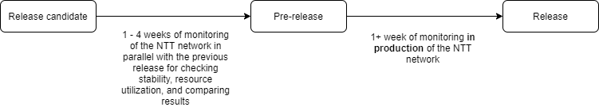

# Release process

We use BGPalerter in production to monitor our network.
It's essential for us to make sure BGPalerter is reliable and secure. As it is essential for us, it is also essential for the many organizations that are currently relying on BGPalerter for their monitoring.
For this reason, we want to summarize in this document our efforts in this matter.

The image below shows the flow for releasing a new version of BGPalerter

## Release candidate
A release candidate is not a release at all, and so it will not appear in the [release tab](https://github.com/nttgin/BGPalerter/releases), it will not have a release number, and its testing is ongoing.
A release candidate is a way for us to identify the set of features that are mature enough to be included in the next release.

We compile the release candidate and we use it to monitor our network. We do this while running in parallel the previous stable release of BGPalerter.
This not only assures us to have at least a stable monitoring running, but also allows us to compare the two versions in terms of resource utilization and reported alerts.
We do such testing for at least 1 week (but in general, especially in busy periods, this lasts more, and we leave it running for up to 4 weeks). 
 
Additionally, we have continuous testing in place and we test the release candidate against the entire data flow generated by [RIPE RIS](https://ris.ripe.net) for the entire v4 and v6 address spaces (6k+ BGP updates per second).
 
## Pre release
We create a pre-release after a release candidate passed the test period. A pre-release is *NOT intended for production deployment*.  
A pre-release appears in the [release tab](https://github.com/nttgin/BGPalerter/releases) marked by an orange label declaring its pre-release status.    
A pre-release is NOT considered `latest`, so you will never update to a pre-release without explicitly selecting its version.  
Additionally, pre-releases are not announced and not notified as updates.

Pre-releases are anyway tested and considered "stable". Consider installing a pre-release if you want to try the latest features.

## Release
We finally create a new release after the pre-release passes the 1 week test period.
A release appears in the [release tab](https://github.com/nttgin/BGPalerter/releases) and it is marked with a green label "latest release".  
The availability of a new release is notified.

### Release number
The release number is composed of 3 digis `x.x.x`:

* The first number identifies a breaking release. The first number is incremented only when the breaking change cannot be addressed with a deprecation warning.
* The second number identifies a major release. The second number is incremented if new functionalities are introduced.
* The third number identifies a minor release. The third number is incremented when there are changes which don't introduce any new functionality but improve the available ones.

### Patching
In the event a serious bug (e.g., affecting one of the core functionalities) is discovered in a released version, we will not follow the timing described above and release as soon as possible a minor release.
Minor releases are anyway tested and deployed for the monitoring of our network.

A minor release can also be released as a part of the normal release cycle in case there are no new features to justify a major release. 

### Dependencies
We use [Dependabot](https://dependabot.com/) to automatically check for newer version of the dependencies used by BGPalerter.
The dependencies used are listed in [package.json](https://github.com/nttgin/BGPalerter/blob/dev/package.json). 
It is important to distinguish between the dependencies used for development and the one used for production. Only production dependencies are bundled in the binary of a release.

### Module isolation
BGPalerter includes a series of components (i.e. connectors, monitors, reports) each of them are enabled from config.yml.
All components are bundled in the binary release, BUT they are loaded (and so also their dependencies) only if enabled from the config file.
If a component is not enabled from the config file, the component file is not loaded and the code not executed.

### Automation

We currently use the following automation on the repository:

* [GitHub Actions](https://github.com/nttgin/BGPalerter/actions) to perform tests on each commit and pull request.
* [Dependabot](https://dependabot.com/) to check for newer version of the dependencies used.
* [Hound](https://houndci.com/) to check code correctness and style. 
* [GitHub Security Alerts](https://github.com/nttgin/BGPalerter/network/alerts) to check for vulnerabilities on the entire repository.

# Git flow

1) The development happens in the `dev` branch.
2) When a set of feature is defined as the next release candidate, the `dev` branch is branched to create the `release` branch, which contains the release candidate code.
3) The release candidate is tested as described above.
4) After the test period, the release candidate is promoted to pre-release:
    1) The source is tagged with a tag reporting the release number
    2) It is compiled and released in the [release tab](https://github.com/nttgin/BGPalerter/releases)
5) The pre-release is tested
6) After the test period, the pre-released is marked as latest and released as stable.
    1) Clients will be notified of the new release.
7) The `release` branch is merged in `master` and after deleted.

All pull requests must happen against the `dev` branch (or rebased during review). If needed they will be cherry-picked in the `release` branch.
